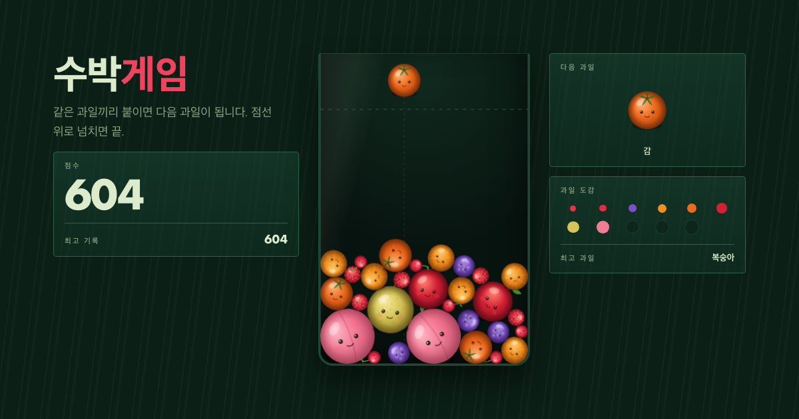

# 🍉 수박게임

같은 과일끼리 붙여 체리부터 수박까지 키우는 물리 퍼즐 게임.
외부 라이브러리 없이 **원-원 충돌 물리 엔진을 직접 구현**했습니다.

**▶ 플레이: https://ayun-jeong.github.io/suika-game/**



## 규칙

체리 → 딸기 → 포도 → 한라봉 → 감 → 사과 → 배 → 복숭아 → 파인애플 → 멜론 → **수박**

같은 과일 두 개가 닿으면 다음 단계 과일 하나로 합쳐집니다. 수박 두 개가 만나면 터지면서 100점.
점선 위로 과일이 1.5초 넘게 머무르면 게임 오버입니다.

## 조작

| 입력 | 동작 |
| --- | --- |
| 마우스 이동 / 터치 드래그 | 조준 |
| 클릭 / 탭 | 투하 |
| ← → | 조준 (Shift = 미세 조정) |
| Space / Enter / ↓ | 투하 |

점수·최고 기록·최고 과일은 브라우저에 저장됩니다.

## 물리 엔진

`assets/game.js` 한 파일에 전부 들어 있습니다.

- **순차 임펄스 솔버** — 프레임당 3 서브스텝 × 10회 반복
- 위치 보정(슬롭 0.01px) + 법선 반발(e=0.05) + 접선 마찰(μ=0.45)
- 마찰 임펄스가 회전 관성에 토크를 주기 때문에 과일이 실제로 **굴러서** 빈틈으로 파고듭니다
- 충돌 판정은 제곱거리로 먼저 거르고 겹칠 때만 `sqrt` 실행

검증 결과 (Node 헤드리스 시뮬레이션 8회 × 최대 4분):

| 항목 | 결과 |
| --- | --- |
| 벽·바닥 탈출 | 0회 |
| NaN 발생 | 0회 |
| 평균 겹침 | 0.7 ~ 1.7px |
| 프레임당 연산 | 0.12 ~ 0.17ms (과일 60개 기준) |

## 구조

```
index.html          마크업
assets/style.css    스타일 (수박 단면에서 가져온 색)
assets/game.js      물리 엔진 + 렌더링 + 게임 로직
assets/favicon.svg
assets/og.png
```

빌드 도구 없이 정적 파일 3개로 동작합니다. 로컬에서 보려면 `index.html`을 브라우저로 열면 끝.
